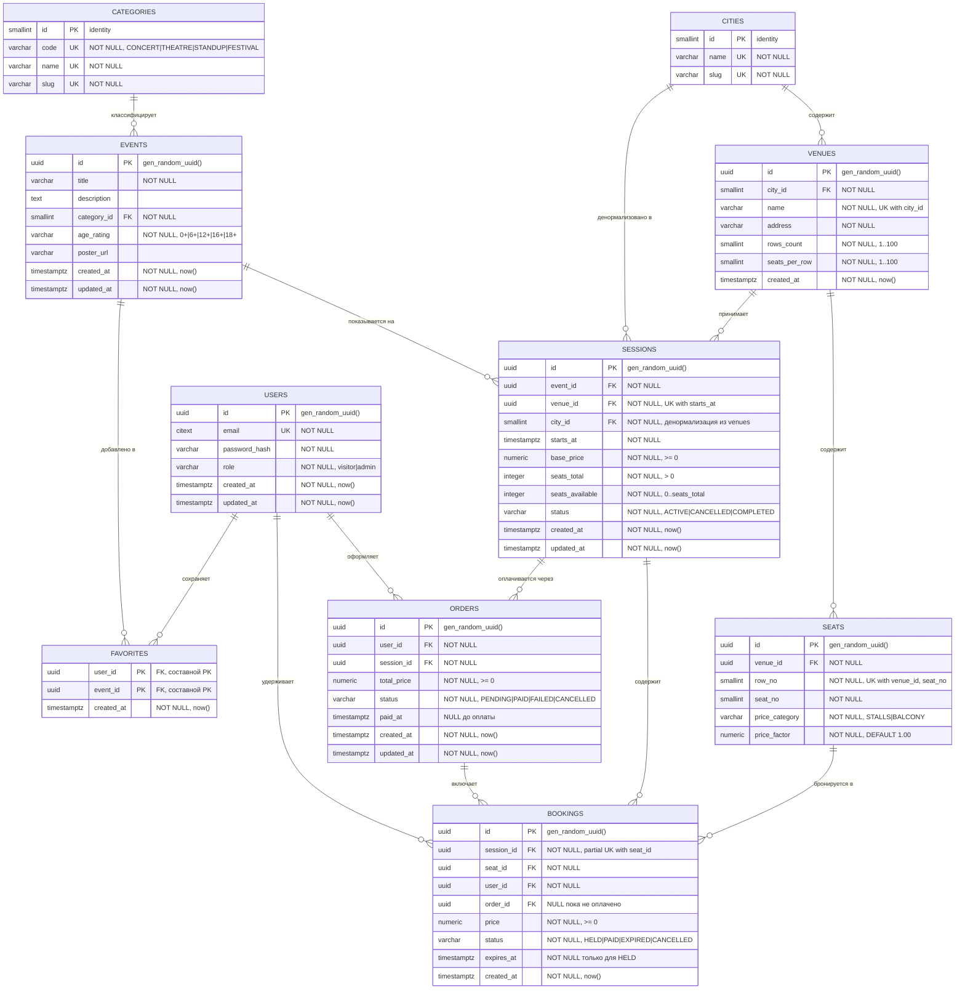

# Схема базы данных


## 1. Соглашения

| Правило | Значение |
|---|---|
| Регистр | `snake_case` для всех идентификаторов |
| Имена таблиц | Множественное число: `events`, `sessions` |
| Имена столбцов | Единственное число, без префикса таблицы: `title`, а не `event_title` |
| Внешние ключи | `<таблица_в_ед_числе>_id`: `event_id`, `venue_id` |
| Первичные ключи | `pk_<таблица>` |
| Внешние ключи | `fk_<таблица>_<ссылка>` |
| Уникальные ограничения | `uq_<таблица>_<столбцы>` |
| Проверочные ограничения | `ck_<таблица>_<правило>` |
| Индексы | `ix_<таблица>_<столбцы>` |
| Суррогатные ключи | `uuid` c `gen_random_uuid()` для бизнес-сущностей; `smallint`/`integer` identity для справочников |
| Дата и время | Только `timestamptz`. `timestamp` без зоны не используется |
| Деньги | Только `numeric(10,2)`. `float`/`real`/`money` запрещены |
| Обязательность | `NOT NULL` по умолчанию; nullable — только там, где отсутствие значения имеет смысл |
| Удаление | Явная политика `ON DELETE` у каждого внешнего ключа |

**Про выбор типа ключа.** Справочники (`cities`, `categories`) используют
короткие целочисленные ключи: строк единицы, они участвуют в составных индексах,
и 2 байта против 16 у `uuid` заметно влияют на размер индекса. Бизнес-сущности
используют `uuid`, потому что их идентификаторы попадают в URL и в API, а
последовательные целые раскрывают объём данных и позволяют перебор.

---

## 2. ER-диаграмма



---

## 3. Сущности

### 3.1 `cities` — города

Справочник. В MVP одна строка (Москва), но поле вынесено в таблицу, чтобы
`sessions.city_id` был внешним ключом, а не свободной строкой.

| Столбец | Тип | Ограничения |
|---|---|---|
| `id` | `smallint` | `pk_cities`, GENERATED ALWAYS AS IDENTITY |
| `name` | `varchar(100)` | NOT NULL, `uq_cities_name` |
| `slug` | `varchar(100)` | NOT NULL, `uq_cities_slug` |

---

### 3.2 `categories` — категории событий

Справочник из четырёх строк. Реализован таблицей, а не типом `enum`
PostgreSQL: добавление значения в `enum` требует миграции с блокировкой, а
строка в справочнике добавляется без DDL.

| Столбец | Тип | Ограничения |
|---|---|---|
| `id` | `smallint` | `pk_categories`, IDENTITY |
| `code` | `varchar(20)` | NOT NULL, `uq_categories_code`, `ck_categories_code` IN (`CONCERT`, `THEATRE`, `STANDUP`, `FESTIVAL`) |
| `name` | `varchar(100)` | NOT NULL, `uq_categories_name` |
| `slug` | `varchar(100)` | NOT NULL, `uq_categories_slug` |

`code` — стабильный идентификатор для кода приложения, `name` — отображаемое
название, `slug` — сегмент URL. Разделены, чтобы переименование категории не
ломало ни ссылки, ни логику.

---

### 3.3 `users` — пользователи

| Столбец | Тип | Ограничения |
|---|---|---|
| `id` | `uuid` | `pk_users`, DEFAULT `gen_random_uuid()` |
| `email` | `citext` | NOT NULL, `uq_users_email` |
| `password_hash` | `varchar(255)` | NOT NULL |
| `role` | `varchar(20)` | NOT NULL, DEFAULT `'VISITOR'`, `ck_users_role` IN (`VISITOR`, `ADMIN`) |
| `created_at` | `timestamptz` | NOT NULL, DEFAULT `now()` |
| `updated_at` | `timestamptz` | NOT NULL, DEFAULT `now()` |

`citext` вместо `varchar` — регистронезависимое сравнение на уровне типа.
Иначе `Ivan@mail.ru` и `ivan@mail.ru` создадут двух пользователей, а
`lower(email)` в уникальном индексе заставляет помнить про `lower()` в каждом
запросе.

Пароль хранится только как bcrypt-хеш. Столбца с открытым паролем нет и быть
не может.

---

### 3.4 `venues` — площадки

| Столбец | Тип | Ограничения |
|---|---|---|
| `id` | `uuid` | `pk_venues`, DEFAULT `gen_random_uuid()` |
| `city_id` | `smallint` | NOT NULL, `fk_venues_city` → `cities(id)` ON DELETE RESTRICT |
| `name` | `varchar(255)` | NOT NULL |
| `address` | `varchar(500)` | NOT NULL |
| `rows_count` | `smallint` | NOT NULL, `ck_venues_rows` BETWEEN 1 AND 100 |
| `seats_per_row` | `smallint` | NOT NULL, `ck_venues_seats_per_row` BETWEEN 1 AND 100 |
| `created_at` | `timestamptz` | NOT NULL, DEFAULT `now()` |

**Уникальность:** `uq_venues_city_name (city_id, name)` — две площадки с одним
названием в одном городе недопустимы, в разных городах — нормально.

`rows_count` и `seats_per_row` описывают прямоугольную сетку. Верхняя граница
100 × 100 = 10 000 мест защищает от опечатки в админке, которая сгенерирует
миллион строк в `seats`.

---

### 3.5 `seats` — места в зале

Места принадлежат **площадке**, а не сеансу. Схема зала задаётся один раз;
занятость определяется парой «сеанс + место» в `bookings`.

| Столбец | Тип | Ограничения |
|---|---|---|
| `id` | `uuid` | `pk_seats`, DEFAULT `gen_random_uuid()` |
| `venue_id` | `uuid` | NOT NULL, `fk_seats_venue` → `venues(id)` ON DELETE CASCADE |
| `row_no` | `smallint` | NOT NULL, `ck_seats_row_no` > 0 |
| `seat_no` | `smallint` | NOT NULL, `ck_seats_seat_no` > 0 |
| `price_category` | `varchar(20)` | NOT NULL, `ck_seats_price_category` IN (`STALLS`, `BALCONY`) |
| `price_factor` | `numeric(4,2)` | NOT NULL, DEFAULT `1.00`, `ck_seats_price_factor` BETWEEN 0.10 AND 10.00 |

**Уникальность:** `uq_seats_venue_row_seat (venue_id, row_no, seat_no)`.

Цена билета = `sessions.base_price × seats.price_factor`, округление до
копеек по правилам банковского округления в приложении.

`ON DELETE CASCADE` здесь оправдан: места не имеют смысла без площадки.
Удаление самой площадки при этом заблокировано наличием сеансов.

**Объём:** зал 20 × 30 = 600 строк. Восемь площадок — 4800 строк. Места **не**
создаются на каждый сеанс: при 2000 сеансов это дало бы 1,2 млн строк вместо
пяти тысяч.

---

### 3.6 `events` — события

Событие — это произведение или мероприятие как таковое: «Гамлет», а не
конкретный показ.

| Столбец | Тип | Ограничения |
|---|---|---|
| `id` | `uuid` | `pk_events`, DEFAULT `gen_random_uuid()` |
| `title` | `varchar(255)` | NOT NULL, `ck_events_title_not_blank` `length(btrim(title)) > 0` |
| `description` | `text` | NULL допустим |
| `category_id` | `smallint` | NOT NULL, `fk_events_category` → `categories(id)` ON DELETE RESTRICT |
| `age_rating` | `varchar(3)` | NOT NULL, `ck_events_age_rating` IN (`0+`, `6+`, `12+`, `16+`, `18+`) |
| `poster_url` | `varchar(500)` | NULL допустим |
| `created_at` | `timestamptz` | NOT NULL, DEFAULT `now()` |
| `updated_at` | `timestamptz` | NOT NULL, DEFAULT `now()`, поддерживается триггером |

Уникальности по `title` нет намеренно: разные постановки одного произведения
существуют одновременно и законно.

---

### 3.7 `sessions` — сеансы

Конкретный показ события: площадка, дата и время, базовая цена.

| Столбец | Тип | Ограничения |
|---|---|---|
| `id` | `uuid` | `pk_sessions`, DEFAULT `gen_random_uuid()` |
| `event_id` | `uuid` | NOT NULL, `fk_sessions_event` → `events(id)` ON DELETE RESTRICT |
| `venue_id` | `uuid` | NOT NULL, `fk_sessions_venue` → `venues(id)` ON DELETE RESTRICT |
| `city_id` | `smallint` | NOT NULL, `fk_sessions_city` → `cities(id)` ON DELETE RESTRICT |
| `starts_at` | `timestamptz` | NOT NULL |
| `base_price` | `numeric(10,2)` | NOT NULL, `ck_sessions_base_price` >= 0 |
| `seats_total` | `integer` | NOT NULL, `ck_sessions_seats_total` > 0 |
| `seats_available` | `integer` | NOT NULL, `ck_sessions_seats_available` BETWEEN 0 AND `seats_total` |
| `status` | `varchar(20)` | NOT NULL, DEFAULT `'ACTIVE'`, `ck_sessions_status` IN (`ACTIVE`, `CANCELLED`, `COMPLETED`) |
| `created_at` | `timestamptz` | NOT NULL, DEFAULT `now()` |
| `updated_at` | `timestamptz` | NOT NULL, DEFAULT `now()`, триггер |

**Уникальность:** `uq_sessions_venue_starts_at (venue_id, starts_at)` — в одном
зале не может идти два показа одновременно. Без этого ограничения генератор
тестовых данных гарантированно создаст пересечения.

#### Две денормализации и их обоснование

**`city_id`** дублирует `venues.city_id`. Причина: главный запрос каталога
фильтрует по городу и сортирует по дате. Составной индекс
`(city_id, starts_at)` на `sessions` закрывает и фильтр, и сортировку одним
проходом; через JOIN с `venues` планировщику пришлось бы сортировать результат
соединения. Поддерживается триггером `trg_sessions_sync_city` при вставке и при
смене `venue_id`. Изменение города у площадки в MVP запрещено на уровне
приложения.

**`seats_total`** дублирует `rows_count × seats_per_row`. Причина другая:
вместимость площадки может измениться, а уже проданный сеанс обязан помнить
свою. Это не кэш, а снимок значения на момент создания — такая денормализация
корректна и не требует синхронизации.

**`seats_available`** — производное значение, поддерживаемое приложением в той
же транзакции, что и брони. Источник истины — таблица `bookings`. Счётчик
существует, чтобы каталог показывал «осталось 12 мест», не читая тысячу строк
броней на каждый сеанс в списке.

---

### 3.8 `orders` — заказы

| Столбец | Тип | Ограничения |
|---|---|---|
| `id` | `uuid` | `pk_orders`, DEFAULT `gen_random_uuid()` |
| `user_id` | `uuid` | NOT NULL, `fk_orders_user` → `users(id)` ON DELETE RESTRICT |
| `session_id` | `uuid` | NOT NULL, `fk_orders_session` → `sessions(id)` ON DELETE RESTRICT |
| `total_price` | `numeric(10,2)` | NOT NULL, `ck_orders_total_price` >= 0 |
| `status` | `varchar(20)` | NOT NULL, DEFAULT `'PENDING'`, `ck_orders_status` IN (`PENDING`, `PAID`, `FAILED`, `CANCELLED`) |
| `paid_at` | `timestamptz` | NULL, `ck_orders_paid_at` — NOT NULL тогда и только тогда, когда `status = 'PAID'` |
| `created_at` | `timestamptz` | NOT NULL, DEFAULT `now()` |
| `updated_at` | `timestamptz` | NOT NULL, DEFAULT `now()`, триггер |

Столбца `quantity` нет: количество билетов выводится из числа связанных
броней. Хранить его отдельно означало бы иметь два источника истины, которые
рано или поздно разойдутся.

`total_price` **хранится**, а не вычисляется из цены сеанса: цена на момент
покупки должна быть зафиксирована, иначе изменение `base_price` задним числом
перепишет историю всех заказов.

Ограничение `ck_orders_paid_at` записывается как
`(status = 'PAID') = (paid_at IS NOT NULL)` — это делает невозможным
оплаченный заказ без времени оплаты и наоборот.

---

### 3.9 `bookings` — брони мест

Центральная таблица продажи. Связывает сеанс, место и пользователя.

| Столбец | Тип | Ограничения |
|---|---|---|
| `id` | `uuid` | `pk_bookings`, DEFAULT `gen_random_uuid()` |
| `session_id` | `uuid` | NOT NULL, `fk_bookings_session` → `sessions(id)` ON DELETE RESTRICT |
| `seat_id` | `uuid` | NOT NULL, `fk_bookings_seat` → `seats(id)` ON DELETE RESTRICT |
| `user_id` | `uuid` | NOT NULL, `fk_bookings_user` → `users(id)` ON DELETE RESTRICT |
| `order_id` | `uuid` | NULL, `fk_bookings_order` → `orders(id)` ON DELETE RESTRICT |
| `price` | `numeric(10,2)` | NOT NULL, `ck_bookings_price` >= 0 |
| `status` | `varchar(20)` | NOT NULL, `ck_bookings_status` IN (`HELD`, `PAID`, `EXPIRED`, `CANCELLED`) |
| `expires_at` | `timestamptz` | NULL, `ck_bookings_expires_at` — NOT NULL тогда и только тогда, когда `status = 'HELD'` |
| `created_at` | `timestamptz` | NOT NULL, DEFAULT `now()` |

**Ключевое ограничение целостности:**

```sql
CREATE UNIQUE INDEX uq_bookings_active_seat
    ON bookings (session_id, seat_id)
    WHERE status IN ('HELD', 'PAID');
```

Частичный уникальный индекс, а не обычное `UNIQUE`-ограничение. Разница
принципиальна: обычное `UNIQUE (session_id, seat_id)` заблокировало бы место
навсегда после первой же протухшей брони, потому что строка со статусом
`EXPIRED` осталась бы в индексе. Условие `WHERE` выводит завершённые брони из
индекса и освобождает место.

Именно это ограничение реализует BR-01: два пользователя одновременно жмут на
одно кресло, второй получает нарушение уникальности, которое приложение
транслирует в бизнес-ошибку «место уже занято». Проверка «свободно ли место»
запросом с последующей вставкой некорректна: между `SELECT` и `INSERT` место
успевает занять другой.

**Следствие: фоновая задача обязательна.** Условие частичного индекса не может
ссылаться на `now()` — выражение в индексе должно быть `IMMUTABLE`. Значит
истечение срока брони не выводится запросом, а должно быть записано в таблицу:

```sql
UPDATE bookings
SET status = 'EXPIRED'
WHERE status = 'HELD' AND expires_at < now();
```

Без этой задачи схема зала заполнится намертво за первый день эксплуатации.
Периодичность — раз в минуту.

`order_id` пуст, пока бронь не оплачена. Это отражает жизненный цикл: сначала
`HELD` без заказа, затем создание `PENDING`-заказа, затем перевод в `PAID`.

---

### 3.10 `favorites` — избранное

| Столбец | Тип | Ограничения |
|---|---|---|
| `user_id` | `uuid` | `fk_favorites_user` → `users(id)` ON DELETE CASCADE |
| `event_id` | `uuid` | `fk_favorites_event` → `events(id)` ON DELETE CASCADE |
| `created_at` | `timestamptz` | NOT NULL, DEFAULT `now()` |

**Первичный ключ:** `pk_favorites (user_id, event_id)` — составной.

Суррогатного `id` нет намеренно. Это ассоциативная таблица связи
многие-ко-многим: составной ключ одновременно является и первичным ключом, и
ограничением уникальности, и покрывающим индексом для выборки избранного
пользователя.

---

## 4. Индексы

Уникальные ограничения из раздела 3 создают индексы автоматически и здесь не
дублируются. Ниже — индексы, добавляемые ради производительности чтения.

| Индекс | Таблица | Выражение | Обоснование |
|---|---|---|---|
| `ix_sessions_city_starts_at` | `sessions` | `(city_id, starts_at) WHERE status = 'ACTIVE'` | Главный запрос каталога: активные сеансы в городе по возрастанию даты. Закрывает фильтр и сортировку одним проходом. Частичный — записи отменённых и прошедших сеансов в каталоге не нужны и не занимают место в индексе (US-01, US-03) |
| `ix_events_fts` | `events` | `USING GIN (to_tsvector('russian', title \|\| ' ' \|\| coalesce(description, '')))` | Полнотекстовый поиск по названию и описанию. Выражение в запросе должно совпадать с выражением в индексе символ в символ, иначе индекс не применится — проверять через `EXPLAIN` (US-02) |
| `ix_events_category_id` | `events` | `(category_id)` | Фильтр каталога по категории. Селективность низкая (4 значения), поэтому индекс полезен в основном как поддержка соединения (US-03) |
| `ix_events_title_trgm` | `events` | `USING GIN (title gin_trgm_ops)` | Поиск по подстроке и опечаткам, дополняет FTS. Требует расширения `pg_trgm`. Опционально, если поиск по префиксу окажется недостаточным (US-02) |
| `ix_sessions_event_starts_at` | `sessions` | `(event_id, starts_at)` | Список сеансов на странице события, отсортированный по времени (US-05) |
| `ix_seats_venue` | `seats` | `(venue_id, row_no, seat_no)` | Отрисовка схемы зала в естественном порядке. Совпадает с `uq_seats_venue_row_seat`, отдельно создавать не нужно (US-10) |
| `ix_bookings_session_active` | `bookings` | `(session_id) WHERE status IN ('HELD','PAID')` | Построение карты занятости зала при открытии схемы. Частичный — завершённые брони не участвуют (US-10) |
| `ix_bookings_expiry` | `bookings` | `(expires_at) WHERE status = 'HELD'` | Фоновая задача освобождения протухших броней. Без него задача сканирует всю таблицу каждую минуту |
| `ix_bookings_order` | `bookings` | `(order_id) WHERE order_id IS NOT NULL` | Загрузка мест по заказу в личном кабинете (US-15) |
| `ix_orders_user_created` | `orders` | `(user_id, created_at DESC)` | Список заказов пользователя, новые сверху (US-15) |
| `ix_orders_session` | `orders` | `(session_id)` | Массовая отмена заказов при отмене сеанса (US-23) |

**Индексы, которые сознательно не создаются:**

- по `sessions.status` отдельно — три значения, селективность недостаточна;
  статус уже входит в условие частичных индексов выше
- по `users.role` — две строки-значения на всю таблицу
- по `favorites` — покрывается составным первичным ключом

---

## 5. Ограничения целостности уровня БД

| Правило требований | Реализация |
|---|---|
| BR-01 · место не занимается дважды | `uq_bookings_active_seat`, частичный уникальный индекс |
| BR-02 · бронь удерживается 15 минут | `bookings.expires_at` + фоновая задача перевода в `EXPIRED` |
| BR-03 · нельзя создать сеанс в прошлом | **Только приложение.** `CHECK (starts_at > now())` невозможен: `now()` не `IMMUTABLE`, PostgreSQL отклонит такое ограничение |
| BR-04 · нельзя купить на отменённый сеанс | Приложение; на уровне БД потребовался бы триггер |
| BR-05 · оплачен только после ответа шлюза | `ck_orders_paid_at`: `(status = 'PAID') = (paid_at IS NOT NULL)` |
| BR-06 · отмена сеанса освобождает места | Приложение, в одной транзакции |
| BR-07 · пользователь видит только свои заказы | Приложение; RLS в MVP не используется |
| BR-08 · нельзя менять схему зала при активных бронях | Приложение + `ON DELETE RESTRICT` на `seats` со стороны `bookings` |

Правила, реализуемые только приложением, отмечены явно. Утверждение «БД
гарантирует всё» было бы неправдой, и на защите это проверяется первым
вопросом.

---

## 6. Триггеры

| Триггер | Таблица | Назначение |
|---|---|---|
| `trg_events_updated_at` | `events` | `updated_at = now()` при `UPDATE` |
| `trg_sessions_updated_at` | `sessions` | То же |
| `trg_orders_updated_at` | `orders` | То же |
| `trg_users_updated_at` | `users` | То же |
| `trg_sessions_sync_city` | `sessions` | Проставляет `city_id` из `venues` при `INSERT` и при смене `venue_id` |

Без триггера на `updated_at` столбец навсегда останется равным `created_at`:
`DEFAULT now()` срабатывает только при вставке.

---

## 7. Оценка объёма

| Таблица | Строк в MVP | Комментарий |
|---|---|---|
| `cities` | 1 | Москва |
| `categories` | 4 | Фиксированный справочник |
| `venues` | 5–8 | Генератор |
| `seats` | ~4 800 | 8 площадок × ~600 мест |
| `events` | 300–500 | Генератор |
| `sessions` | 2 000+ | 4–6 сеансов на событие |
| `users` | 20–50 | Тестовые + реальные аккаунты команды |
| `bookings` | 5 000–20 000 | Зависит от объёма нагрузочной генерации |
| `orders` | 2 000–8 000 | |

Объём тестовых данных выбран так, чтобы полнотекстовый поиск, фильтры и
сортировка давали осмысленную выдачу. На сотне событий поиск демонстрировать
бессмысленно: любой запрос вернёт либо всё, либо ничего.

---

## 8. Что не реализовано в схеме и почему

| Отсутствует | Причина |
|---|---|
| Таблица платежей | Оплата эмулируется, история попыток не требуется. Статус в `orders` достаточен |
| Мягкое удаление (`deleted_at`) | В MVP нет сценария удаления сущностей; вместо удаления сеанса — статус `CANCELLED` |
| Аудит изменений | Не входит в требования MVP |
| Ценовые зоны сложнее двух категорий | Раздел «Won't have» требований |
| Партиционирование `sessions` по дате | Оправдано от миллионов строк; на 2000 строк вредно |
| Row Level Security | Разграничение доступа реализуется в сервисном слое |
