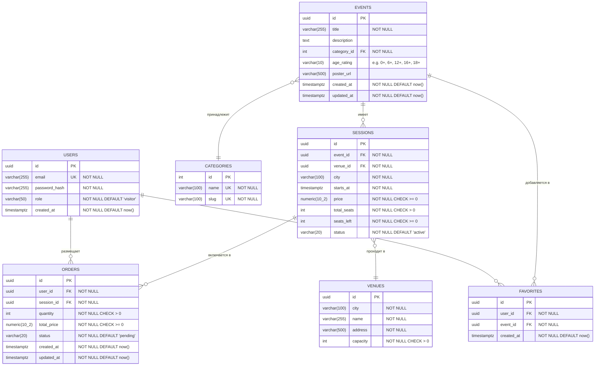

# Схема базы данных

## ER-диаграмма



---

## Сущности

### USERS

| Поле          | Тип          | Ограничения                                              |
|---------------|--------------|----------------------------------------------------------|
| id            | uuid         | PK, DEFAULT gen_random_uuid()                            |
| email         | varchar(255) | NOT NULL, UNIQUE                                         |
| password_hash | varchar(255) | NOT NULL                                                 |
| role          | varchar(50)  | NOT NULL, DEFAULT 'visitor', CHECK IN ('visitor','admin') |
| created_at    | timestamptz  | NOT NULL, DEFAULT now()                                  |

### CATEGORIES

| Поле | Тип          | Ограничения      |
|------|--------------|------------------|
| id   | int          | PK, SERIAL       |
| name | varchar(100) | NOT NULL, UNIQUE |
| slug | varchar(100) | NOT NULL, UNIQUE |

### VENUES

| Поле     | Тип          | Ограничения                    |
|----------|--------------|--------------------------------|
| id       | uuid         | PK, DEFAULT gen_random_uuid()  |
| city     | varchar(100) | NOT NULL                       |
| name     | varchar(255) | NOT NULL                       |
| address  | varchar(500) | NOT NULL                       |
| capacity | int          | NOT NULL, CHECK (capacity > 0) |

### EVENTS

| Поле        | Тип          | Ограничения                                          |
|-------------|--------------|------------------------------------------------------|
| id          | uuid         | PK, DEFAULT gen_random_uuid()                        |
| title       | varchar(255) | NOT NULL                                             |
| description | text         |                                                      |
| category_id | int          | FK → categories.id, NOT NULL                         |
| age_rating  | varchar(10)  | CHECK IN ('0+','6+','12+','16+','18+')               |
| poster_url  | varchar(500) |                                                      |
| created_at  | timestamptz  | NOT NULL, DEFAULT now()                              |
| updated_at  | timestamptz  | NOT NULL, DEFAULT now()                              |

### SESSIONS

| Поле        | Тип           | Ограничения                                                         |
|-------------|---------------|---------------------------------------------------------------------|
| id          | uuid          | PK, DEFAULT gen_random_uuid()                                       |
| event_id    | uuid          | FK → events.id, NOT NULL                                            |
| venue_id    | uuid          | FK → venues.id, NOT NULL                                            |
| city        | varchar(100)  | NOT NULL                                                            |
| starts_at   | timestamptz   | NOT NULL                                                            |
| price       | numeric(10,2) | NOT NULL, CHECK (price >= 0)                                        |
| total_seats | int           | NOT NULL, CHECK (total_seats > 0)                                   |
| seats_left  | int           | NOT NULL, CHECK (seats_left >= 0)                                   |
| status      | varchar(20)   | NOT NULL, DEFAULT 'active', CHECK IN ('active','cancelled','completed') |

> `city` денормализован из `venues.city` для эффективной фильтрации каталога без JOIN.

### ORDERS

| Поле        | Тип           | Ограничения                                                    |
|-------------|---------------|----------------------------------------------------------------|
| id          | uuid          | PK, DEFAULT gen_random_uuid()                                  |
| user_id     | uuid          | FK → users.id, NOT NULL                                        |
| session_id  | uuid          | FK → sessions.id, NOT NULL                                     |
| quantity    | int           | NOT NULL, CHECK (quantity > 0)                                 |
| total_price | numeric(10,2) | NOT NULL, CHECK (total_price >= 0)                             |
| status      | varchar(20)   | NOT NULL, DEFAULT 'pending', CHECK IN ('pending','paid','cancelled','failed') |
| created_at  | timestamptz   | NOT NULL, DEFAULT now()                                        |
| updated_at  | timestamptz   | NOT NULL, DEFAULT now()                                        |

### FAVORITES

| Поле       | Тип         | Ограничения                             |
|------------|-------------|-----------------------------------------|
| id         | uuid        | PK, DEFAULT gen_random_uuid()           |
| user_id    | uuid        | FK → users.id, NOT NULL, ON DELETE CASCADE |
| event_id   | uuid        | FK → events.id, NOT NULL, ON DELETE CASCADE |
| created_at | timestamptz | NOT NULL, DEFAULT now()                 |

**Уникальность:** UNIQUE (user_id, event_id)

---

## Индексы

| Индекс | Таблица | Выражение | Обоснование |
|--------|---------|-----------|-------------|
| `idx_sessions_city_starts_at` | sessions | `(city, starts_at)` | Главный запрос каталога: события в городе, отсортированные по дате (US-01, US-03) |
| `idx_sessions_event_id` | sessions | `(event_id)` | Загрузка списка сеансов на странице события (US-05) |
| `idx_sessions_status_starts_at` | sessions | `(status, starts_at)` | Фильтрация активных сеансов при построении каталога |
| `idx_events_fts` | events | `USING GIN (to_tsvector('russian', title \|\| ' ' \|\| coalesce(description, '')))` | Полнотекстовый поиск по названию и описанию (US-02) |
| `idx_events_category_id` | events | `(category_id)` | Фильтрация по категории (US-03) |
| `idx_orders_user_id` | orders | `(user_id, created_at DESC)` | Список заказов пользователя в личном кабинете (US-14) |
| `idx_orders_session_id` | orders | `(session_id)` | Отображение заказов при отмене сеанса (US-20) |
| `idx_favorites_user_id` | favorites | `(user_id)` | Список избранного пользователя (US-16) |
| `idx_venues_city` | venues | `(city)` | Фильтрация площадок по городу (US-07) |

### Конкурентное обновление seats_left

При покупке билетов используется оптимистичная блокировка:

```sql
UPDATE sessions
SET seats_left = seats_left - :qty
WHERE id = :session_id
  AND seats_left >= :qty;
-- Если 0 строк затронуто — показываем US-13 "нет мест"
```
